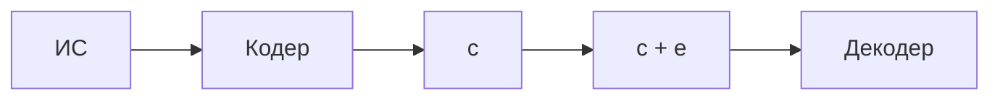

# Лекция 3. Синдромное декодирование

## Синдромное декодирование

Линейный $(n,k)$-код.

$$
R = \frac{k}{n}
$$

$$
G: k \times n
$$

$$
H: (n-k) \times n
$$

$$
GF(2)=\{0,1\}
$$

$$
G H^T = 0
$$

Размерности:

$$
(k \times n)(n \times (n-k)).
$$

## Алгоритм декодирования $(n,k)$ линейных кодов над $GF(2)$

Схема передачи:

Задача декодера - найти кодовое слово, отличающееся от принятого слова в наименьшем числе позиций.

Пусть

$$
\bar c \in C.
$$

Принятое слово:

$$
\bar y = \bar c + \bar e.
$$

Вектор ошибки:

$$
\bar e=(e_1,\dots,e_n).
$$

## Количество комбинаций ошибок

Всего существует

$$
2^n
$$

двоичных векторов длины $n$.

Код содержит

$$
2^k
$$

кодовых слов.

Число смежных классов:

$$
\frac{2^n}{2^k}=2^{n-k}.
$$

Обозначим

$$
N=2^{n-k}.
$$

## Пример

Пусть

$$
G=
\begin{pmatrix}
1 & 0 & 1 \\
0 & 1 & 1
\end{pmatrix}.
$$

Проверочная матрица:

$$
H=\begin{pmatrix}1 & 1 & 1\end{pmatrix}.
$$

Здесь

$$
k=2.
$$

Кодовые слова:

$$
C=\{000,101,011,110\}.
$$

Все векторы длины $3$:

$$
000,001,010,011,100,101,110,111.
$$

Так как

$$
n-k=1,
$$

получается

$$
2^{n-k}=2
$$

смежных класса.

Первый смежный класс:

$$
C=\{000,101,011,110\}.
$$

Второй смежный класс:

$$
001+C=\{001,100,010,111\}.
$$

То же множество можно получить с другими лидерами из этого класса:

$$
010+C=\{010,111,001,100\}.
$$

$$
100+C=\{100,001,111,010\}.
$$

## Синдром

Для любого кодового слова:

$$
\bar c H^T=0.
$$

Пусть

$$
\bar y=\bar c+\bar e.
$$

Синдром:

$$
s=\bar yH^T.
$$

Тогда

$$
s=(\bar c+\bar e)H^T.
$$

$$
s=\bar cH^T+\bar eH^T.
$$

Так как

$$
\bar cH^T=0,
$$

получаем

$$
s=\bar eH^T.
$$

## Таблица синдромов для примера

| $\bar e$ | $s=\bar eH^T$ |
|---|---:|
| $000$ | $0$ |
| $001$ | $1$ |
| $010$ | $1$ |
| $011$ | $0$ |
| $100$ | $1$ |
| $101$ | $0$ |
| $110$ | $0$ |
| $111$ | $1$ |

Например,

$$
c_2=101.
$$

Если ошибка равна

$$
\bar e=100,
$$

то

$$
c_2+\bar e=101+100=001.
$$

## Исправление по синдрому

Нужно подобрать такой вектор ошибки $\bar e_i$, что

$$
(\bar y+\bar e_i)H^T=0.
$$

Тогда

$$
\bar y+\bar e_i=\bar c.
$$

## Пример: код повторения

Пусть

$$
G=\begin{pmatrix}1 & 1 & 1\end{pmatrix}.
$$

Проверочная матрица:

$$
H=
\begin{pmatrix}
1 & 0 & 1 \\
0 & 1 & 1
\end{pmatrix}.
$$

$$
H^T=
\begin{pmatrix}
1 & 0 \\
0 & 1 \\
1 & 1
\end{pmatrix}.
$$

Таблица синдромов:

| $\bar e$ | $s=\bar eH^T$ |
|---|---:|
| $000$ | $00$ |
| $001$ | $11$ |
| $010$ | $01$ |
| $011$ | $10$ |
| $100$ | $10$ |
| $101$ | $01$ |
| $110$ | $11$ |
| $111$ | $00$ |

Лидеры смежных классов минимального веса:

| $s$ | Лидер $\bar e$ |
|---|---|
| $00$ | $000$ |
| $01$ | $010$ |
| $10$ | $100$ |
| $11$ | $001$ |

Пусть принято слово

$$
\bar y=110.
$$

Синдром:

$$
\bar yH^T=11.
$$

Для синдрома $11$ лидер ошибки:

$$
\bar e=001.
$$

Исправление:

$$
110+001=111.
$$

## Радиус покрытия

Минимальное расстояние определяет число исправляемых ошибок:

$$
t=\left\lfloor\frac{d_{\min}-1}{2}\right\rfloor.
$$

Радиус покрытия - это наибольшее число ошибок, которые может исправить код.

## Геометрическая интерпретация

Задача построения кода с заданной кратностью исправления $t$ ошибок - это задача упаковки пространства шарами радиуса $t$ с центрами в заданных кодовых словах.

## Граница Хэмминга

Рассматривается $q$-ичный код над $GF(q)$.

Если

$$
d \ge 2t+1,
$$

то код исправляет до $t$ ошибок.

Объем шара Хэмминга радиуса $t$:

$$
\sum_{i=0}^{t} C_n^i(q-1)^i.
$$

Если число кодовых слов равно $M$, то

$$
M \le \frac{q^n}{\sum_{i=0}^{t} C_n^i(q-1)^i}.
$$

Здесь

$$
C_n^0(q-1)^0
$$

соответствует отсутствию ошибок,

$$
C_n^1(q-1)^1
$$

соответствует одной ошибке.

## Граница Варшамова-Гилберта

Если

$$
q^{n-k}>\sum_{i=0}^{d-2}C_{n-1}^i(q-1)^i,
$$

то существует $q$-ичный $(n,k)$-код с минимальным расстоянием $d$.

Если минимальное расстояние кода равно $d$, то любые $d-1$ столбцов проверочной матрицы должны быть линейно независимы.

При построении проверочной матрицы $H$ столбцы выбираются последовательно:

1. первый столбец должен быть ненулевым;
2. второй столбец не должен быть кратен первому;
3. каждый следующий столбец не должен выражаться через малое число предыдущих столбцов.

Для $i$-го столбца запрещаются варианты, которые являются линейными комбинациями не более чем $d-2$ предыдущих столбцов.

Число запрещенных вариантов оценивается суммой

$$
\sum_{j=0}^{d-2}C_{i-1}^j(q-1)^j.
$$

Из границы Синглтона:

$$
d \le n-k+1.
$$
