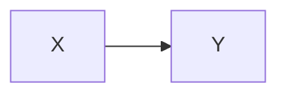
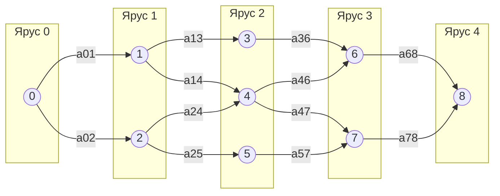
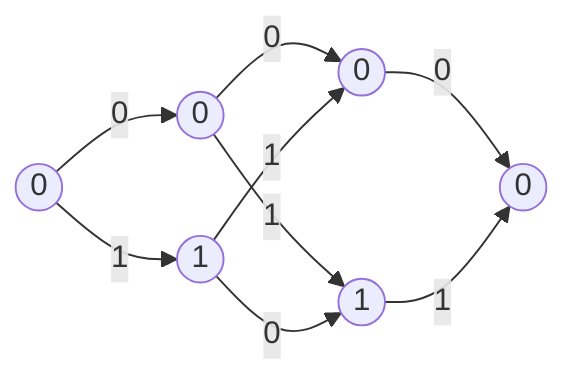

# Лекция 4. Декодирование по максимуму правдоподобия

## Декодирование по максимуму правдоподобия

Канал задается вероятностями перехода

$$
p(y|x),\qquad x\in X,\; y\in Y.
$$

Код:

$$
C=\{\bar c_i,\; i=1,\dots,M\}\subseteq X^n.
$$

Принятое слово:

$$
\bar y=(y_1,y_2,\dots,y_n).
$$

Функция правдоподобия:

$$
\max_i p(\bar y|\bar c_i),\qquad i=1,\dots,M.
$$

Для канала без памяти:

$$
p(\bar y|\bar x)=\prod_{i=1}^{n}p(y_i|x_i).
$$

Логарифм функции правдоподобия:

$$
\Lambda_m(\bar y)=\ln p(\bar y|\bar c_m)=\sum_{i=1}^{n}\ln p(y_i|c_{mi}).
$$

## Отношение правдоподобия

Для одного символа:

$$
L(y)=\ln\frac{p(y|1)}{p(y|0)}.
$$

Если $y=1$, то

$$
L(y)>0.
$$

Если $y=0$, то

$$
L(y)<0.
$$

Вектор надежности:

$$
L(\bar y)=(L(y_1),L(y_2),\dots,L(y_n)).
$$

Для кодового слова вводится вектор

$$
\xi_m=(\xi_{m1},\xi_{m2},\dots,\xi_{mn}),
$$

где

$$
\xi_{mi}=2c_{mi}-1.
$$

Если

$$
c_{mi}=0,
$$

то

$$
\xi_{mi}=-1.
$$

Если

$$
c_{mi}=1,
$$

то

$$
\xi_{mi}=1.
$$

Метрика:

$$
L_m(\bar y)=(\xi_m,L(\bar y)).
$$

## Теорема

Для ДСК декодирование по максимуму правдоподобия сводится к поиску того кодового слова, для которого максимальна величина

$$
L_m(\bar y)=(\xi_m,L(\bar y)).
$$

Пусть есть два кодовых слова $\bar c_m$ и $\bar c_{m'}$.

Нужно показать, что

$$
\Lambda_m(\bar y)\ge \Lambda_{m'}(\bar y)
$$

эквивалентно

$$
L_m(\bar y)\ge L_{m'}(\bar y).
$$

Вводятся множества:

$$
I_{00}=\{j: c_{mj}=0,\; c_{m'j}=0\},
$$

$$
I_{01}=\{j: c_{mj}=0,\; c_{m'j}=1\},
$$

$$
I_{10}=\{j: c_{mj}=1,\; c_{m'j}=0\},
$$

$$
I_{11}=\{j: c_{mj}=1,\; c_{m'j}=1\}.
$$

Разность метрик:

$$
L_m(\bar y)-L_{m'}(\bar y)=2\sum_{j\in I_{10}}L(y_j)-2\sum_{j\in I_{01}}L(y_j).
$$

Так как

$$
L(y_j)=\ln\frac{p(y_j|1)}{p(y_j|0)},
$$

получается связь с логарифмом отношения правдоподобий.

## Двоичный симметричный канал

Для ДСК:

$$
L(y)=\ln\frac{p(y|1)}{p(y|0)}.
$$

Тогда

$$
L(y)=
\begin{cases}
\ln\dfrac{1-p_0}{p_0}, & y=1,\\
\ln\dfrac{p_0}{1-p_0}, & y=0.
\end{cases}
$$

Для кодового слова:

$$
L_m(\bar y)=\sum_{i=1}^{n}(2c_{mi}-1)L(y_i).
$$

Получается:

$$
L_m(\bar y)=a(\bar y,\bar c_m)(-\delta)+(m-a(\bar y,\bar c_m))\delta,
$$

где $a(\bar y,\bar c_m)$ - число позиций, в которых $\bar y$ и $\bar c_m$ различаются.

Если

$$
p_0<\frac12,
$$

то декодирование по максимуму правдоподобия совпадает с декодированием по минимуму расстояния Хэмминга.

## Поиск кратчайшего пути в решетке

Решетка кода:

Свойства решетки:

1. вершины разбиты на непересекающиеся множества - ярусы;
2. нулевой и последний ярусы содержат по одному узлу;
3. решетка - направленный граф;
4. ребра приписаны символам;
5. длина пути равна сумме метрик ребер, входящих в путь;
6. каждому пути соответствует кодовое слово.

Пример:

$$
G=
\begin{pmatrix}
1 & 1 & 0\\
0 & 1 & 1
\end{pmatrix}.
$$

Кодовые слова:

$$
000,\;110,\;011,\;101.
$$

## Минимальные узлы решетки

Чем меньше узлов, тем эффективнее декодирование решетчатых графов.

Пусть

$$
C=\{\bar c_m,\;m=1,\dots,M\}.
$$

Для каждого кодового слова

$$
\bar c_m=(c_{m1},c_{m2},\dots,c_{mn})
$$

разделим кодовое слово на две части:

$$
\bar c_m=(c_m^p,c_m^f),
$$

где $c_m^p$ - past, $c_m^f$ - future.

Множество будущих частей:

$$
F_i(c^p)=\{c^f:(c^p,c^f)\in C\}.
$$

## Пример

$$
G=
\begin{pmatrix}
1 & 0 & 1 & 1 & 0 & 1\\
1 & 0 & 1 & 0 & 1 & 0\\
1 & 1 & 0 & 1 & 0 & 0
\end{pmatrix}.
$$

Кодовые слова:

| Номер | Кодовое слово |
|---:|---|
| $c_0$ | $000000$ |
| $c_1$ | $101101$ |
| $c_2$ | $101010$ |
| $c_3$ | $110100$ |
| $c_4$ | $000111$ |
| $c_5$ | $011001$ |
| $c_6$ | $011110$ |
| $c_7$ | $110011$ |
