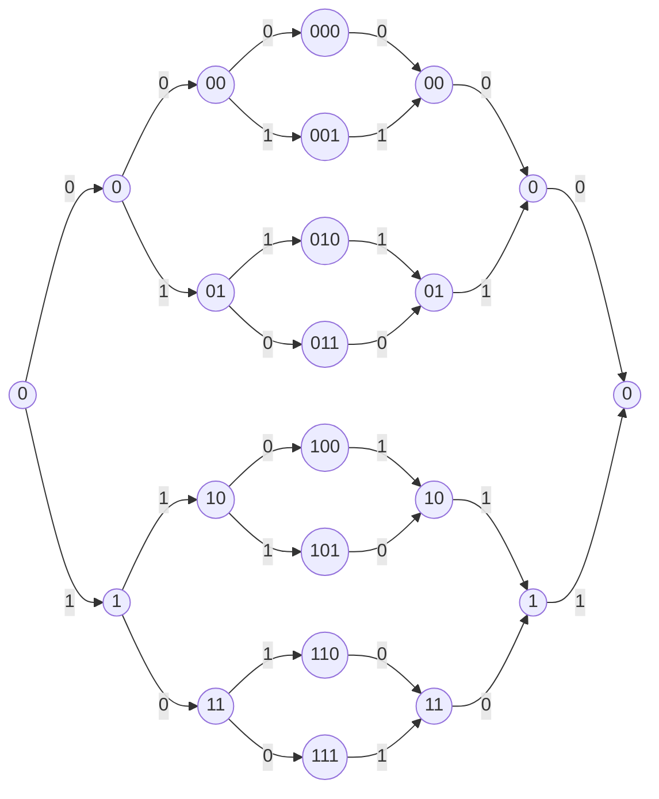

# Лекция 5. Построение решетки кода по порождающей матрице

## Построение решетки кода по порождающей матрице

Пусть

$$
X=(x_1,x_2,\dots,x_n).
$$

Для каждой строки определяются:

- начало $b(x)$ - номер позиции первого ненулевого элемента;
- конец $e(x)$ - номер позиции последнего ненулевого элемента.

Активные элементы - элементы, у которых текущая позиция лежит между $b(x)$ и $e(x)$.

Пример:

$$
X=(0,0,1,0,1,1,1,0,0).
$$

Тогда

$$
b(X)=3,\qquad e(X)=7.
$$

## Приведение порождающей матрицы к минимальной спэнтовой форме

Все начала $b(x)$ и все концы $e(x)$ строк должны быть различны.

Исходная матрица:

$$
G=
\begin{pmatrix}
1 & 0 & 1 & 1 & 0 & 1\\
1 & 0 & 1 & 0 & 1 & 0\\
1 & 1 & 0 & 1 & 0 & 0
\end{pmatrix}.
$$

Преобразования строк над $GF(2)$:

$$
g_2=g_2+g_1.
$$

Получаем:

$$
\begin{pmatrix}
1 & 0 & 1 & 1 & 0 & 1\\
0 & 0 & 0 & 1 & 1 & 1\\
1 & 1 & 0 & 1 & 0 & 0
\end{pmatrix}.
$$

Далее:

$$
g_3=g_3+g_1.
$$

Получаем:

$$
\begin{pmatrix}
1 & 0 & 1 & 1 & 0 & 1\\
0 & 0 & 0 & 1 & 1 & 1\\
0 & 1 & 1 & 0 & 0 & 1
\end{pmatrix}.
$$

Минимальная спэнтовая форма:

$$
G=
\begin{pmatrix}
1 & 1 & 0 & 1 & 0 & 0\\
0 & 1 & 1 & 1 & 1 & 0\\
0 & 0 & 0 & 1 & 1 & 1
\end{pmatrix}.
$$

## Узлы решетки

Узлы на ярусе нумеруются информационными символами, соответствующими активным строкам.

Кодовые слова:

| $m$ | $c=mG$ |
|---|---|
| $000$ | $000000$ |
| $001$ | $000111$ |
| $010$ | $011110$ |
| $011$ | $011001$ |
| $100$ | $110100$ |
| $101$ | $110011$ |
| $110$ | $101010$ |
| $111$ | $101101$ |

Решетка по порождающей матрице:

## Теорема

Решетка, полученная из минимальной спэнтовой формы порождающей матрицы, является минимальной.

Доказательство: пути, определяющие кодовые символы с одинаковыми последовательностями в будущем, не проходят через различные узлы на соответствующем ярусе.

Пусть на некотором ярусе $l$ узлы определяются кодовыми символами с одинаковой последовательностью будущего $c^f$ некоторой длины $n-l$.

Для конкретного слова путь на ярусе $l$ определяется значениями информационных символов, соответствующих активным строкам на этом ярусе.
