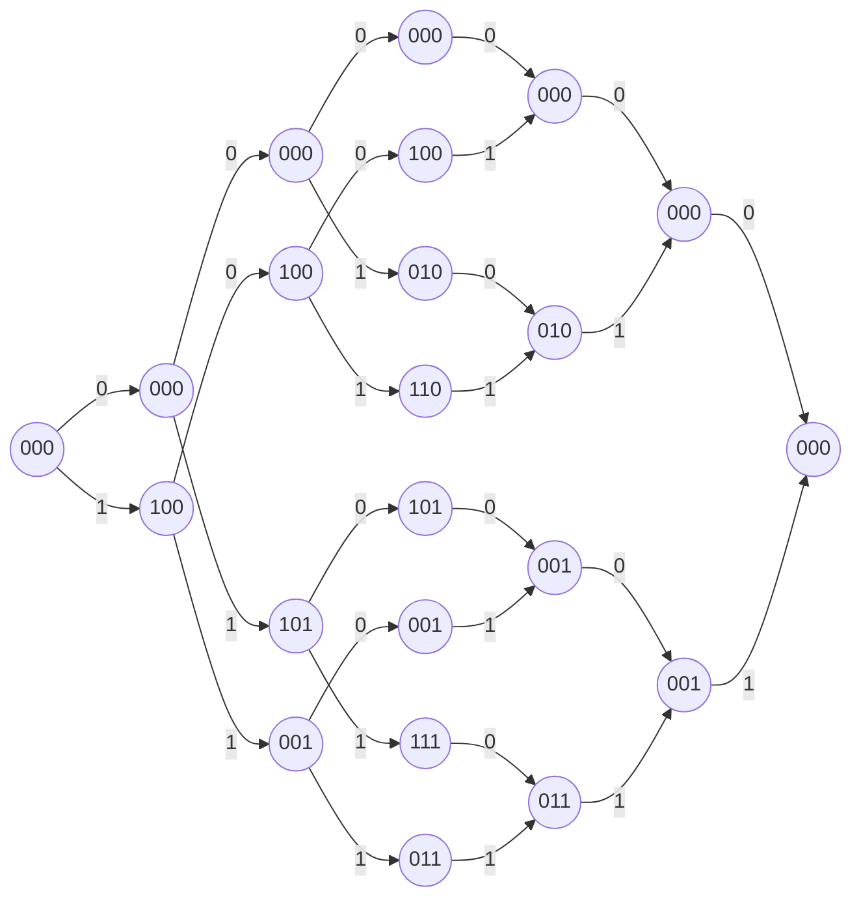

# Лекция 6. Синдромная решетка и циклические коды

## Представление кода в виде проверочной матрицы

Если

$$
R>\frac12,
$$

то представление кода в виде проверочной матрицы компактнее.

Пример:

$$
G=
\begin{pmatrix}
1 & 0 & 1 & 1 & 0 & 1\\
1 & 0 & 1 & 0 & 1 & 0\\
1 & 1 & 0 & 1 & 0 & 0
\end{pmatrix}.
$$

$$
H=
\begin{pmatrix}
1 & 1 & 0 & 0 & 1 & 1\\
0 & 0 & 1 & 0 & 1 & 1\\
0 & 1 & 0 & 1 & 0 & 1
\end{pmatrix}.
$$

Кодовые слова:

$$
000000,\;101101,\;101010,\;110100,\;000111,\;011110,\;011001,\;110011.
$$

Узлы каждого яруса будем нумеровать накопленными синдромами.

## Синдромная решетка

Если $H_i$ - $i$-й столбец матрицы $H$, то

$$
s_i=s_{i-1}+c_iH_i.
$$

Для кодового слова полный синдром равен нулю:

$$
cH^T=0.
$$

Синдромная решетка:

## Синдромная решетка минимальна

Достаточно показать, что кодовые слова с одинаковым будущим не проходят через различные узлы.

Пусть

$$
\bar c=(c^p,c^f).
$$

Рассмотрим два кодовых слова:

$$
\bar c_1=(c_1^p,c^f),\qquad \bar c_2=(c_2^p,c^f).
$$

Так как оба слова кодовые, полный синдром равен нулю:

$$
\bar cH^T=0.
$$

Частные синдромы по прошлому и будущему согласованы.

## Верхняя граница на максимальную сложность

$$
\xi_{\max}\le \min\{2^k,2^{n-k}\}.
$$

## Циклические коды

Циклический код - подкласс линейных блочных кодов.

Если все циклические сдвиги кодового слова снова являются кодовыми словами, то код циклический.

Пусть

$$
F_q=GF(q)=\{0,1,\dots,q-1\}.
$$

Кодовому слову длины $n$ сопоставляется многочлен

$$
f(x)=f_0+f_1x+\dots+f_{n-1}x^{n-1}.
$$

Сдвиг соответствует умножению на $x$ по модулю $x^n-1$:

$$
xf(x) \pmod{x^n-1}.
$$

Если появляется $x^n$, то

$$
x^n\equiv 1 \pmod{x^n-1}.
$$

## Порождающий многочлен циклического кода

Среди всех ненулевых кодовых слов выбирается слово-многочлен наименьшей степени:

$$
g(x)=g_0+g_1x+\dots+x^h.
$$

Тогда каждое кодовое слово делится на $g(x)$.

Если $m(x)$ - информационный многочлен, то

$$
c(x)=m(x)g(x)\pmod{x^n-1}.
$$

Степень порождающего многочлена:

$$
h=n-k.
$$

## Пример циклического кода $(3,2)$

$$
G=
\begin{pmatrix}
1 & 1 & 0\\
0 & 1 & 1
\end{pmatrix}.
$$

Кодовые слова:

| Кодовое слово | Многочлен |
|---|---|
| $000$ | $0$ |
| $110$ | $1+x$ |
| $011$ | $x+x^2$ |
| $101$ | $1+x^2$ |

Порождающий многочлен:

$$
g(x)=1+x.
$$

## Делимость $x^n-1$ на порождающий многочлен

Если $g(x)$ - порождающий многочлен циклического кода, то

$$
g(x)\mid x^n-1.
$$

Проверочный многочлен:

$$
h(x)=\frac{x^n-1}{g(x)}.
$$

Если $c(x)$ - кодовое слово, то

$$
c(x)h(x)=0 \pmod{x^n-1}.
$$

## Пример кода Хэмминга

$$
g(x)=1+x^2+x^3.
$$

Для $n=7$:

$$
x^7-1=x^7+1
$$

над $GF(2)$.

Порождающая матрица:

$$
G=
\begin{pmatrix}
1 & 0 & 1 & 1 & 0 & 0 & 0\\
0 & 1 & 0 & 1 & 1 & 0 & 0\\
0 & 0 & 1 & 0 & 1 & 1 & 0\\
0 & 0 & 0 & 1 & 0 & 1 & 1
\end{pmatrix}.
$$

Минимальное расстояние:

$$
d_{\min}=3.
$$
