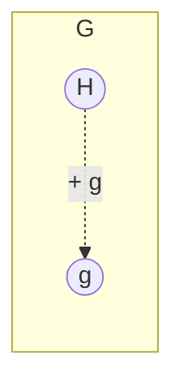

# Лекция 7

## Приведенный полином

В циклическом $(n,k)$-коде среди всех кодовых слов существует приведенный полином $g(x)$ наименьшей степени $h$:

$$
g_0 + g_1x + g_2x^2 + \dots + 1x^h.
$$

Теорема: для $(n,k)$-циклического кода, если $g(x)$ - кодовое слово наименьшей степени $h$, то любое кодовое слово делится на $g(x)$.

$$
c(x)=g(x)q(x)+r(x).
$$

Примеры деления:

$$
\frac{x^2+x}{x+1}=x.
$$

$$
\frac{x^2+1}{x+1}=x+1.
$$

Следствие: если $g(x)$ - кодовое слово степени $h$, то $g(x)$ является делителем $x^n-1$.

$$
x^n-1=g(x)q(x)+r(x).
$$

Так как вычисления ведутся по модулю $x^n-1$, то

$$
x^n-1 \equiv 0 \pmod{x^n-1}.
$$

Следовательно,

$$
g(x)q(x)+r(x) \equiv 0 \pmod{x^n-1}.
$$

Если $g(x)$ имеет степень $h$, то

$$
x^{n-h-1}g(x)
$$

имеет степень

$$
n-h-1+h=n-1.
$$

А многочлен

$$
x^{n-h}g(x)
$$

имеет степень $n$.

Значит, $g(x)$ - порождающий полином.

Пример:

$$
g(x)=1+x^2+x^3.
$$

В двоичной записи:

$$
g(x)=1011.
$$

Здесь

$$
h=3, \qquad n=7.
$$

Порождающая матрица строится сдвигами коэффициентов порождающего полинома:

```text
G = [1 0 1 1 0 0 0
     0 1 0 1 1 0 0
     0 0 1 0 1 1 0
     0 0 0 1 0 1 1]
```

В общем виде:

```text
G = [g0 g1 ... gh  0  ... 0
     0  g0 g1 ... gh ... 0
     ...
     0  ... 0  g0 g1 ... gh]
```

Число строк равно

$$
k=n-h.
$$

---

## Проверочный полином

Проверочный полином определяется как

$$
h(x)=\frac{x^n-1}{g(x)}.
$$

Тогда

$$
h(x)g(x)=x^n-1 \equiv 0 \pmod{x^n-1}.
$$

Если кодовое слово имеет вид

$$
c(x)=m(x)g(x),
$$

то

$$
c(x)h(x)=m(x)g(x)h(x) \equiv 0 \pmod{x^n-1}.
$$

Проверочная матрица строится по коэффициентам проверочного полинома.

Если

$$
h(x)=h_0+h_1x+\dots+h_kx^k,
$$

то проверочная матрица имеет вид:

```text
H = [hk hk-1 ... h0 0  ... 0
     0  hk   ... h1 h0 ... 0
     ...
     0  ...  hk  ... h1 h0]
```

В записи из конспекта также используется обращенный полином:

$$
h(x^{-1})x^k.
$$

---

## Группа

Множество $G=\{g_i\}$ называется группой, если на нем определена некоторая операция $*$ и выполняются следующие условия.

1. Замкнутость:

$$
a,b\in G \Rightarrow a*b\in G.
$$

2. Ассоциативность:

$$
a*(b*c)=(a*b)*c.
$$

3. Существование единичного элемента $e$:

$$
a*e=e*a=a, \qquad \forall a\in G.
$$

4. Для каждого элемента $a\in G$ существует обратный элемент $b\in G$:

$$
a*b=e.
$$

Число элементов в группе называется порядком группы.

Если

$$
a*b=b*a,
$$

то группа называется коммутативной, или абелевой.

Если $H\subset G$ и $H$ сама является группой, то $H$ называется подгруппой группы $G$.

Рассмотрим группу, коммутативную по сложению. Пусть

$$
g\in G, \qquad g\notin H.
$$

Тогда множество

$$
\{h+g,\ h\in H\}
$$

называется смежным классом группы по подгруппе $H$.

Элемент $g$ называется образующим элементом смежного класса.



Смежные классы либо совпадают, либо не пересекаются.

Группа $G$ естественным образом разбивается на совокупность различных смежных классов по заданной подгруппе.

Порядок подгруппы является делителем порядка группы.

Смежные классы по подгруппе $H$ сами образуют группу. Эта группа называется фактор-группой:

$$
G/H.
$$

Подгруппа $H$ является единичным элементом группы смежных классов.

---

## Пример фактор-группы

Рассмотрим множество

$$
\{0,1,2,3,4,5\}
$$

со сложением по модулю $6$.

Пусть

$$
H=\{0,3\}.
$$

Тогда смежные классы:

$$
\{0,3\}, \qquad \{1,4\}, \qquad \{2,5\}.
$$

Таблица сложения смежных классов:

| $+$ | $\{0,3\}$ | $\{1,4\}$ | $\{2,5\}$ |
|---|---|---|---|
| $\{0,3\}$ | $\{0,3\}$ | $\{1,4\}$ | $\{2,5\}$ |
| $\{1,4\}$ | $\{1,4\}$ | $\{2,5\}$ | $\{0,3\}$ |
| $\{2,5\}$ | $\{2,5\}$ | $\{0,3\}$ | $\{1,4\}$ |

---

## Кольцо

Кольцо - это множество $R$, на котором определены две операции, называемые сложением и умножением, для которых справедливы следующие аксиомы.

1. $R$ - абелева группа по сложению.

2. $R$ замкнуто относительно операции умножения.

3. Ассоциативность умножения:

$$
a(bc)=(ab)c.
$$

4. Дистрибутивность:

$$
a(b+c)=ab+ac.
$$

В кольце может не быть единичного элемента по умножению. Если единичный элемент есть, то это кольцо с единицей.

Если

$$
a*b=b*a,
$$

то кольцо называется коммутативным.

Если ненулевые элементы образуют группу по умножению, то получается поле.

---

## Поле

Поле - множество $F$, на котором определены операции $+$ и $\times$.

1. $F$ - абелева группа по сложению.

2. Ненулевые элементы $F$ - абелева группа по умножению.

Будем рассматривать множество целых чисел $\mathbb Z$ по модулю $q$ и операции $+$ и $\times$.

Такое множество является полем по модулю $q$, если $q$ - простое число.

Обозначение:

$$
GF(q)=F(q).
$$

Примеры:

$$
GF(2)=\{0,1\}.
$$

$$
GF(5)=\{0,1,2,3,4\}.
$$

---

## Кольцо многочленов

Элемент кольца многочленов:

$$
a(x)=a_0+a_1x+a_2x^2+\dots+a_mx^m.
$$

Здесь

$$
a_i\in GF(q).
$$

Множество многочленов обозначается

$$
F[x].
$$

Для приведенного многочлена $p(x)$ степени больше $1$ рассматривается множество всех многочленов степени меньше $p(x)$ с операциями $+$ и $\times$ по модулю $p(x)$.

Обозначение:

$$
F_{p(x)}[x].
$$

Теорема: кольцо $F_{p(x)}[x]$ является полем тогда и только тогда, когда $p(x)$ - простой многочлен, то есть приведенный и неразложимый.

Если $p(x)$ простой, то каждый элемент $F_{p(x)}[x]$ имеет обратный элемент по умножению.

В конспекте используется проверка через сравнение по модулю $p(x)$:

$$
s(x)a(x) \pmod{p(x)}.
$$

$$
s(x)a(x)=s(x)b(x) \pmod{p(x)}.
$$

$$
s(x)(a(x)-b(x)) \equiv 0 \pmod{p(x)}.
$$

Пусть

$$
d(x)=a(x)-b(x).
$$

Тогда

$$
s(x)d(x) \equiv 0 \pmod{p(x)}.
$$

То есть

$$
s(x)d(x)=l(x)p(x) \pmod{p(x)}.
$$

Если $p(x)$ раскладывается, то

$$
p(x)=u(x)v(x).
$$

Для многочлена

$$
p(x)=a_0+a_1x+\dots+1x^m,
\qquad a_i\in GF(q),
$$

элементы можно задавать наборами коэффициентов длины $m$:

```text
000...0
000...1
...
000...q
000...10
...
...
```
