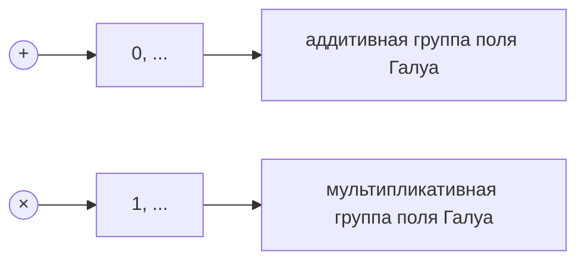
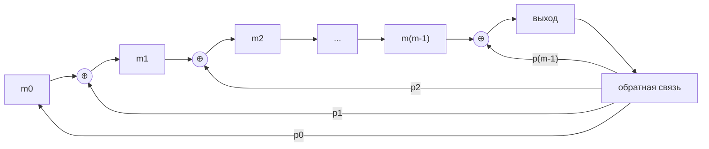
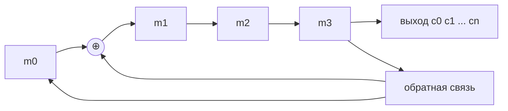

# Лекция 8. Мультипликативная группа поля Галуа



Группа по умножению состоит из $q-1$ элементов.

Выберем некоторый элемент группы:

$$
\alpha \in GF(q).
$$

Рассмотрим его степени:

$$
\alpha,\ \alpha^2,\ \alpha^3,\ \dots,\ \alpha^i \in GF(q).
$$

Для некоторого числа $s$ выполняется

$$
\alpha^s = 1.
$$

Наименьшее $s$, для которого

$$
\alpha^s = 1,
$$

называется порядком элемента $\alpha$.

Так как ненулевых элементов поля $GF(q)$ ровно $q-1$, то

$$
s \mid (q-1).
$$

Для любого ненулевого элемента поля $GF(q)$ выполняется

$$
x^{q-1}-1=0.
$$

Тогда

$$
x(x^{q-1}-1)=0.
$$

Отсюда

$$
x^q-x=0.
$$

Это малая теорема Ферма.

---

## Утверждение 1

Если элементы $a$ и $b$ имеют порядки $s_a$ и $s_b$, и эти порядки взаимно просты, то порядок произведения $ab$ равен произведению их порядков:

$$
s_{ab}=s_a s_b.
$$

Докажем.

Так как

$$
a^{s_a}=1,
$$

и

$$
b^{s_b}=1,
$$

то

$$
(ab)^{s_a s_b}=a^{s_a s_b}b^{s_a s_b}=1.
$$

Остается показать, что $s_{ab}$ не может быть меньше, чем $s_a s_b$.

Пусть существует такое $l$, что

$$
(ab)^l=1.
$$

Тогда

$$
(ab)^{l s_a}=a^{l s_a}b^{l s_a}=b^{l s_a}=1.
$$

Это возможно, если

$$
l s_a
$$

кратно $s_b$.

Так как $s_a$ и $s_b$ взаимно просты, то

$$
l
$$

кратно $s_b$.

Аналогично можно показать, что $l$ кратно $s_a$.

Следовательно,

$$
l=s_a s_b.
$$

---

## Утверждение 2

Если число $s^t$ является делителем $q-1$, то в поле Галуа $GF(q)$ найдется элемент порядка $s^t$.

Пусть

$$
q-1=s^t u.
$$

Тогда

$$
x^{q-1}=1.
$$

Существует элемент $\alpha$, для которого

$$
\alpha^u \ne 1.
$$

Положим

$$
b=\alpha^u.
$$

Тогда

$$
b^{s^t}=(\alpha^u)^{s^t}=\alpha^{u s^t}=\alpha^{q-1}=1.
$$

Значит, порядок элемента $b$ делит $s^t$.

---

## Пример: поле $GF(7)$

Поле:

$$
GF(7)=\{0,1,2,3,4,5,6\}.
$$

Здесь

$$
q=7,
$$

поэтому

$$
q-1=6.
$$

Делители числа $6$:

$$
\{1,2,3,6\}.
$$

Порядки ненулевых элементов:

| Элемент | Степени | Порядок |
|---|---|---|
| $1$ | $1^1=1$ | $1$ |
| $2$ | $2^1=2,\ 2^2=4,\ 2^3=1$ | $3$ |
| $3$ | $3^1=3,\ 3^2=2,\ 3^3=6,\ 3^4=4,\ 3^5=5,\ 3^6=1$ | $6$ |
| $4$ | $4^1=4,\ 4^2=2,\ 4^3=1$ | $3$ |
| $5$ | $5^1=5,\ 5^2=4,\ 5^3=6,\ 5^4=2,\ 5^5=3,\ 5^6=1$ | $6$ |
| $6$ | $6^1=6,\ 6^2=1$ | $2$ |

В поле $GF(7)$ элементы порядка $q-1=6$:

$$
3,\ 5.
$$

---

## Мультипликативная группа поля Галуа

Для поля $GF(q)$ мультипликативная группа ненулевых элементов имеет вид

$$
GF(q)^*=\{1,\alpha,\alpha^2,\dots,\alpha^{q-2}\}.
$$

При этом

$$
\alpha^{q-1}=1.
$$

Мультипликативная группа поля Галуа является циклической группой.

Элемент, при помощи которого можно получить всю группу, называется образующим элементом циклической группы.

Схема расширения поля:

$$
GF(p)\rightarrow GF(p^m).
$$

Например,

$$
GF(5)\rightarrow GF(5^2).
$$

Для поля $GF(5^2)$:

$$
5^2-1=24.
$$

Делители числа $24$:

$$
\{1,2,3,4,6,8,12,24\}.
$$

Если порядок элемента равен $8$, то получаем последовательность:

$$
x^3,\ x^6,\ x^9,\ x^{12},\ x^{15},\ x^{18},\ x^{21},\ x^{24}=1.
$$

То есть

$$
(x^3)^1,\ (x^3)^2,\dots,(x^3)^8.
$$

---

## Пример построения $GF(2^3)$

Пусть

$$
p(x)=1+x+x^3.
$$

Тогда

$$
1+x+x^3=0.
$$

Отсюда

$$
x^3=1+x.
$$

Строим элементы поля как остатки по модулю $p(x)$.

| Степень | Остаток | Вектор |
|---|---|---|
| $x^0$ | $1$ | $100$ |
| $x^1$ | $x$ | $010$ |
| $x^2$ | $x^2$ | $001$ |
| $x^3$ | $1+x$ | $110$ |
| $x^4$ | $x+x^2$ | $011$ |
| $x^5$ | $x^2+x^3=1+x+x^2$ | $111$ |
| $x^6$ | $x+x^2+x^3=1+x^2$ | $101$ |

Также

$$
x^7=1.
$$

---

## Примитивный многочлен

Простой многочлен $p(x)$ степени $m$ с коэффициентами из $GF(p)$ называется примитивным многочленом, если в поле $GF(p^m)$, то есть в поле полиномов по модулю $p(x)$, элемент $x$ является примитивным элементом.

Иначе говоря, $x$ является корнем $p(x)$ и порождает всю мультипликативную группу поля.

В поле $GF(q)$ единичный элемент обладает свойством:

$$
1+1+\dots+1=0.
$$

Минимальное число сложений единицы, при котором получается $0$, называется характеристикой поля.

Для поля $GF(p^m)$ характеристика равна $p$.

В поле характеристики $p$ выполняется равенство:

$$
(x+y)^p=x^p+y^p.
$$

Коэффициенты бинома:

$$
C_p^i=\frac{p!}{i!(p-i)!}
$$

делятся на $p$ при

$$
0<i<p.
$$

---

## Минимальные многочлены

Примеры:

Над $\mathbb R$:

$$
x^2+1=0.
$$

Над $\mathbb C$:

$$
a+ib=0.
$$

Над $\mathbb Q$:

$$
x^2-2=0.
$$

Корни:

$$
x=\pm \sqrt{2},
$$

но

$$
\pm \sqrt{2}\notin \mathbb Q.
$$

Элементы можно записывать в виде

$$
a+\sqrt{2}\,b.
$$

---

Пусть $p(x)$ - многочлен с коэффициентами из $GF(q)$.

Если

$$
p(\alpha)=0,
$$

то $\alpha$ является корнем многочлена $p(x)$.

Если $\alpha$ - корень $p(x)$, то $p(x)$ делится на

$$
x-\alpha.
$$

Так как все элементы поля $GF(q)$ являются корнями многочлена

$$
x^q-x,
$$

то

$$
x^q-x=\prod_{\alpha\in GF(q)}(x-\alpha).
$$

---

## Минимальный многочлен элемента

Минимальным многочленом $M(x)$ над полем $GF(p)$ элемента $\alpha$ в поле $GF(p^m)$ называется неприводимый многочлен наименьшей степени, корнем которого является $\alpha$:

$$
M(\alpha)=0.
$$

Свойства минимального многочлена:

1. $M(x)$ неприводим.

2. Любой многочлен, имеющий корень $\alpha$, делится на $M(x)$.

Пояснение:

$$
f(\alpha)=0.
$$

Если

$$
f(x)=a(x)M(x)+b(x),
$$

то при подстановке $x=\alpha$:

$$
f(\alpha)=a(\alpha)M(\alpha)+b(\alpha)=b(\alpha).
$$

Значит,

$$
b(\alpha)=0.
$$

3. Многочлен

$$
x^{p^m}-x
$$

делится на $M(x)$.

4. Степень $M(x)$ не превышает $m$.

5. Степень $M(x)$ примитивного элемента равна $m$.

---

## Проверочная матрица через степени примитивного элемента

Для поля $GF(2^m)$ проверочная матрица может быть записана через степени примитивного элемента:

$$
H=(1,\alpha,\alpha^2,\dots,\alpha^{2^m-2}).
$$

Здесь

$$
n=2^m-1.
$$

Для примера $m=3$:

$$
n=2^3-1=7.
$$

Используем построенное выше поле $GF(2^3)$ с примитивным многочленом

$$
p(x)=1+x+x^3.
$$

Тогда степени элемента $x$ задаются таблицей:

| Степень | Остаток | Вектор |
|---|---|---|
| $x^0$ | $1$ | $100$ |
| $x^1$ | $x$ | $010$ |
| $x^2$ | $x^2$ | $001$ |
| $x^3$ | $1+x$ | $110$ |
| $x^4$ | $x+x^2$ | $011$ |
| $x^5$ | $1+x+x^2$ | $111$ |
| $x^6$ | $1+x^2$ | $101$ |

Проверочная матрица:

```text
H = [1 0 0 1 0 1 1
     0 1 0 1 1 1 0
     0 0 1 0 1 1 1]
```

Если $\alpha$ является корнем соответствующего многочлена, то многочлен делится на примитивный многочлен.

Пример деления:

$$
\alpha^5+\alpha^4+1
$$

делится на

$$
\alpha^3+\alpha+1.
$$

При делении получается остаток

$$
\alpha^2+\alpha+1.
$$

---

## Код максимальной длины

Если $p(x)$ - примитивный полином над $GF(2^m)$, то

$$
n=2^m-1.
$$

Пусть

$$
h(x)=p(x).
$$

Код максимальной длины задается формулой:

$$
g(x)=\frac{x^{2^m-1}-1}{h(x)}.
$$

---

## Схема регистра

Общая схема регистра:



Для примера:

$$
p(x)=1+x+x^4.
$$

Тогда

$$
GF(2)\rightarrow GF(2^4).
$$

Здесь

$$
n=2^4-1=15,
$$

и рассматривается код

$$
(15,4).
$$

Схема для $p(x)=1+x+x^4$:



---

## Таблица смены состояний

Начальное состояние:

$$
0011.
$$

| Номер | Состояние | Выход |
|---:|---|---:|
| $0$ | $0011$ | $1$ |
| $1$ | $1101$ | $1$ |
| $2$ | $0010$ | $0$ |
| $3$ | $0101$ | $1$ |
| $4$ | $1110$ | $0$ |
